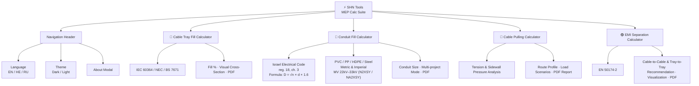

# ⚡ SHN Tools — MEP Calc Suite

**Engineering calculation tools for cable installation workflows.**
Single-page web app with four modules for MEP engineers. Developed by [Shnabel Digital](mailto:mkirsanov91@gmail.com).

🌐 **Live:** [mkirsanov91.github.io/SHN_Tools.Cable](https://mkirsanov91.github.io/SHN_Tools.Cable/)

---

## Modules

| Module | Standard | Output |
|---|---|---|
| **Cable Tray Fill** | IEC 60364 / NEC / BS 7671 | Fill %, visual cross-section, PDF |
| **Conduit Fill** | Israel Electrical Code (reg. 18, ch. 3) | Conduit size, multi-conduit project mode, PDF |
| **Cable Pulling** | Tension & sidewall pressure analysis | Route profile, load scenarios, PDF report |
| **EMI Separation** | EN 50174-2 | Cable-to-cable & tray-to-tray separation, visualization, PDF |

---

## Architecture

---

## Features

- **Multilingual** — English, Hebrew (RTL), Russian
- **Dark / Light theme**
- **PDF export** in every module
- **No install** — pure HTML/CSS/JS, runs in any browser
- **No dependencies** — no server, no framework, no build step

---

## Disclaimer

> These tools are intended for **preliminary estimation only** and do not represent a final engineering determination. Results should be used to understand and evaluate — not as a substitute for professional engineering judgment or official standards compliance verification.

---

## Contact

Questions? Email [mkirsanov91@gmail.com](mailto:mkirsanov91@gmail.com?subject=SHN%20Tools) — please include **SHN Tools** in the subject line.

---

*With respect and love, from Misha 🤍*
